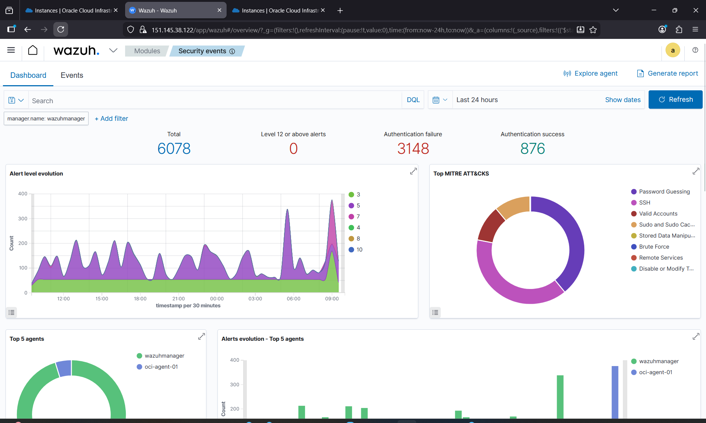
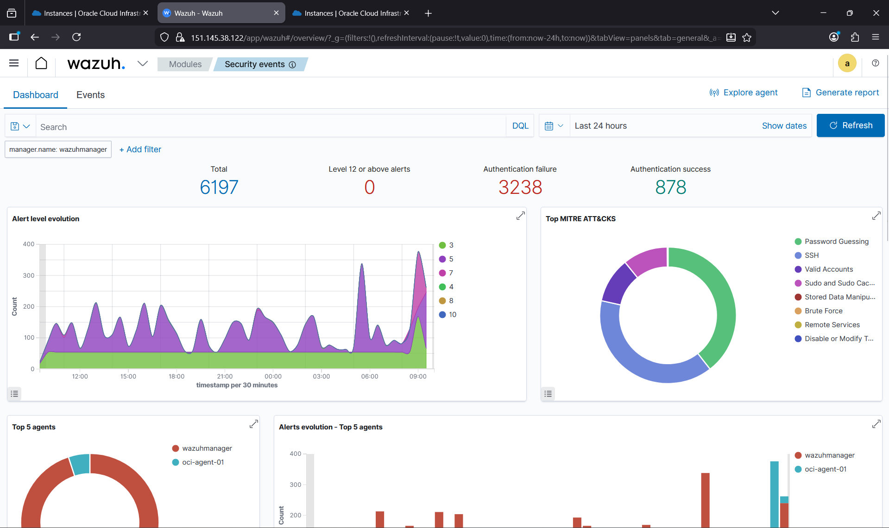
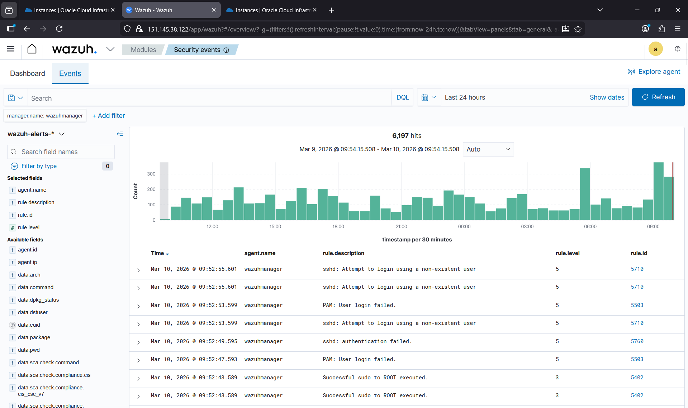

# Lab SOC Cloud-Native — Oracle Cloud Infrastructure

> Simulation d'un Security Operations Center (SOC) réel : déploiement d'un SIEM Wazuh multi-région sur OCI, collecte de logs, détection de menaces et analyse d'alertes avec mapping MITRE ATT&CK.

---

## Objectif du projet

Ce lab reproduit le travail quotidien d'un analyste SOC :

1. **Collecter** les logs de systèmes via des agents Wazuh
2. **Détecter** des comportements malveillants en temps réel
3. **Analyser** les alertes et les corréler avec le framework MITRE ATT&CK
4. **Répondre** en identifiant la source, le vecteur et l'impact de l'attaque

L'infrastructure cloud (OCI + Terraform) sert de support réaliste — comme en entreprise où les serveurs sont dans le cloud.

---

## Scénarios de détection réalisés

### 1. Brute Force SSH (T1110 - Brute Force)

**Simulation :** Attaque par dictionnaire avec Hydra depuis un hôte interne
**Résultat :** 3148 tentatives d'authentification échouées détectées

| Règle Wazuh | Description | Niveau |
|-------------|-------------|--------|
| 5710 | sshd: Attempt to login using a non-existent user | 5 |
| 5760 | sshd: Authentication failed | 5 |
| 5503 | PAM: User login failed | 5 |

**Analyse SOC :** Les règles 5710 et 5760 déclenchées en rafale sur une courte période indiquent une attaque automatisée. L'IP source est interne (pivot possible) — vecteur d'escalade de privilèges.

---

### 2. Reconnaissance réseau (T1046 - Network Service Discovery)

**Simulation :** Scan de ports ciblé avec Nmap
**Résultat :** Connexions TCP anormales détectées sur plusieurs ports en séquence

**Analyse SOC :** Un scan de ports précède généralement une intrusion. Il permet à l'attaquant d'identifier les services exposés avant d'exploiter une vulnérabilité.

---

## Screenshots — Lab en production

### Dashboard Wazuh — Security Events (vue MITRE ATT&CK)


> **6078 événements** détectés en 24h · **3148 échecs d'authentification** · Top attaques : Password Guessing, SSH Brute Force, Valid Accounts

---

### Dashboard Wazuh — Vue générale des agents


> Deux agents actifs : `wazuhmanager` (Montréal) et `oci-agent-01` · Monitoring en temps réel

---

### Événements en direct — Tentatives SSH détectées


> Règles 5710 (login non-existent user), 5760 (auth failed), 5503 (PAM failure) — **attaque brute force SSH active détectée**

---

## Workflow SOC — De l'alerte à l'analyse

```
[Agent Wazuh] ──logs──► [Wazuh Manager] ──indexe──► [OpenSearch]
                                │
                         [Règles de détection]
                                │
                         [Alerte générée]
                                │
                    ┌───────────▼───────────┐
                    │   Dashboard Wazuh     │
                    │  - Niveau de sévérité │
                    │  - Règle déclenchée   │
                    │  - MITRE ATT&CK       │
                    │  - IP source/dest     │
                    └───────────────────────┘
                                │
                    [Analyste SOC investigue]
                                │
                    ┌───────────▼───────────┐
                    │  Questions clés :     │
                    │  Qui ? Quoi ? Quand ? │
                    │  Comment ? Impact ?   │
                    └───────────────────────┘
```

---

## Architecture infrastructure

```
┌─────────────────────────────────────────────────────────────┐
│                    Oracle Cloud Infrastructure               │
│                                                             │
│   ┌──────────────────────┐    ┌──────────────────────┐     │
│   │  ca-montreal-1       │    │  ca-toronto-1        │     │
│   │  (Région principale) │    │  (Région secondaire) │     │
│   │                      │    │                      │     │
│   │  VCN 10.0.0.0/16    │    │  VCN 10.1.0.0/16    │     │
│   │  ┌────────────────┐  │    │  ┌────────────────┐  │     │
│   │  │ Wazuh Manager  │  │    │  │ Wazuh Manager  │  │     │
│   │  │ E4.Flex x86_64 │  │    │  │ E4.Flex x86_64 │  │     │
│   │  │ 4 OCPU / 24GB  │  │    │  │ 4 OCPU / 24GB  │  │     │
│   │  │ Dashboard :443 │  │    │  │ Dashboard :443 │  │     │
│   │  └────────────────┘  │    │  └────────────────┘  │     │
│   │         ▲            │    │                      │     │
│   │    [logs/alertes]    │    │                      │     │
│   │  ┌────────────────┐  │    │  ┌────────────────┐  │     │
│   │  │  Wazuh Agent   │  │    │  │  Wazuh Agent   │  │     │
│   │  │  oci-agent-01  │  │    │  │ Standard3.Flex │  │     │
│   │  └────────────────┘  │    │  └────────────────┘  │     │
│   └──────────────────────┘    └──────────────────────┘     │
└─────────────────────────────────────────────────────────────┘
```

---

## Stack Technologique

| Composant | Technologie | Rôle SOC |
|-----------|-------------|----------|
| SIEM | Wazuh 4.7.5 | Collecte, corrélation, alertes |
| Indexeur | OpenSearch | Stockage et recherche des logs |
| Dashboard | Wazuh UI | Visualisation et investigation |
| Cloud | Oracle Cloud Infrastructure | Infrastructure hôte |
| IaC | Terraform >= 1.3 | Déploiement reproductible |
| OS | Ubuntu 22.04 LTS x86_64 | Système surveillé |
| Firewall | UFW + OCI NSG | Contrôle d'accès réseau |

---

## Déploiement de l'infrastructure

```bash
# 1. Cloner le repo
git clone https://github.com/princeyvan10/labo-soc-oci.git
cd labo-soc-oci

# 2. Configurer les variables
cp terraform.tfvars.example terraform.tfvars
# Éditer terraform.tfvars avec vos OCIDs et clés

# 3. Initialiser Terraform
terraform init

# 4. Vérifier le plan
terraform plan

# 5. Déployer (~20 min)
terraform apply
```

## Structure des fichiers

```
.
├── provider.tf          # Provider OCI (Montréal + alias Toronto)
├── variables.tf         # Variables : auth, réseau, instances
├── main.tf              # Ressources : VCN, NSG, Instances (2 régions)
├── outputs.tf           # IPs, URLs, commandes SSH
├── terraform.tfvars     # Vos valeurs (non versionné)
├── terraform.tfvars.example  # Template
├── deploy.sh            # Script de déploiement assisté
└── .gitignore
```

---

## Accès au Dashboard

Après déploiement (~15 min pour cloud-init) :

```
URL      : https://<wazuh_manager_public_ip>
User     : admin
Password : (généré lors de l'installation — voir logs)
```

---

## Note importante — UFW / iptables OCI

OCI Ubuntu configure UFW par défaut. S'assurer que les ports Wazuh sont ouverts :

```bash
sudo ufw allow 443/tcp
sudo ufw allow 1514/tcp
sudo ufw allow 1514/udp
sudo ufw allow 1515/tcp
sudo ufw allow 55000/tcp
sudo ufw reload
```

---

## Compétences démontrées

**SOC / Cybersécurité**
- Analyse et triage d'alertes SIEM (Wazuh)
- Mapping des menaces avec le framework MITRE ATT&CK
- Simulation d'attaques et validation de la détection
- Investigation d'incidents (brute force, reconnaissance réseau)
- Interprétation de logs SSH, PAM, système

**Infrastructure & Cloud**
- Terraform multi-provider (alias de région OCI)
- Architecture réseau cloud (VCN, IGW, Security Lists, NSG)
- Administration Linux (UFW, iptables, systemd)
- Déploiement SIEM Wazuh en environnement cloud
- Infrastructure as Code et automatisation

---

**Auteur** : Prince Yvan Djine Kadji
**Contact** : kadjiyvan8@gmail.com
**LinkedIn** : [Prince Yvan Djine Kadji](https://www.linkedin.com/in/prince-yvan-djine-kadji-40a91737b)
